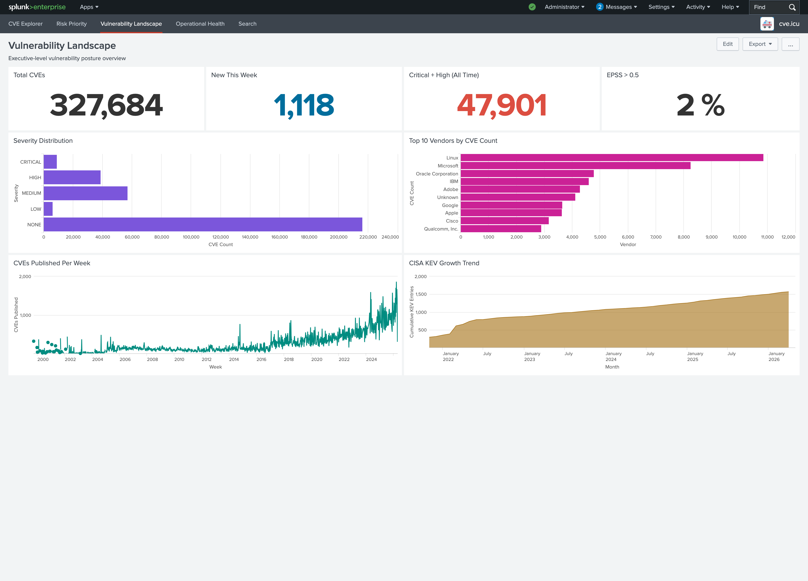
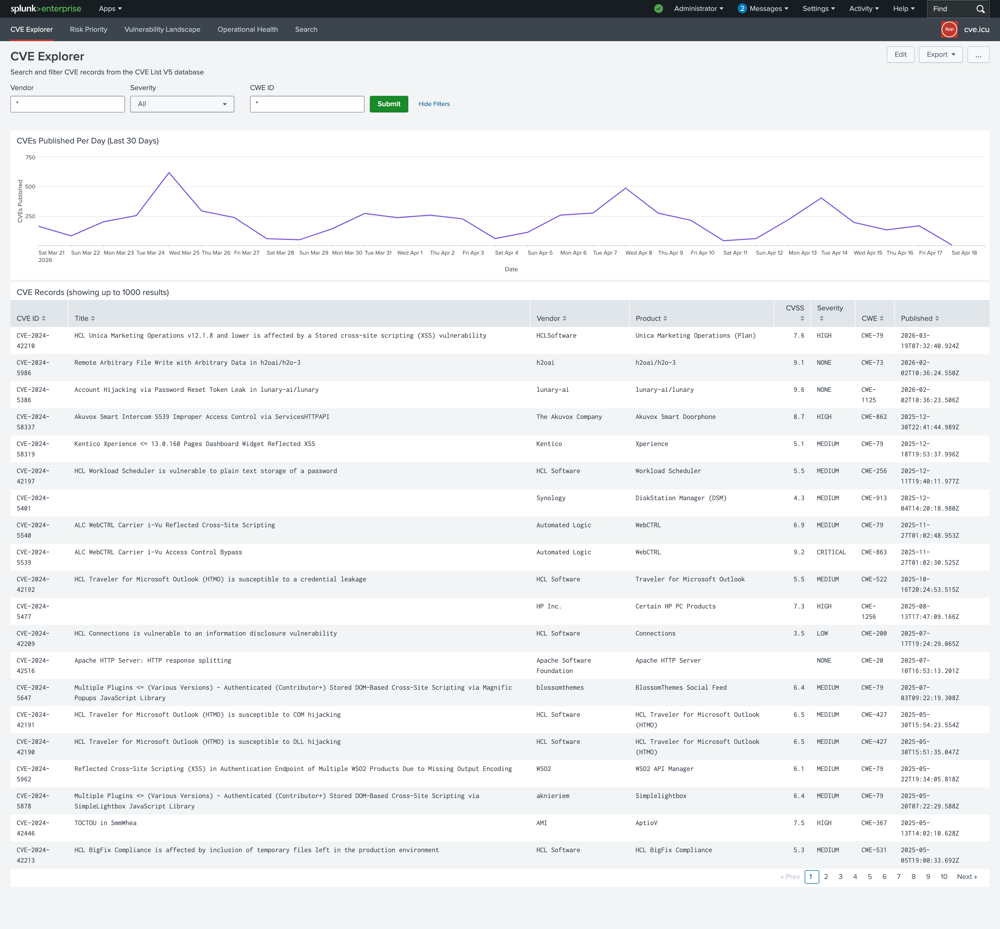
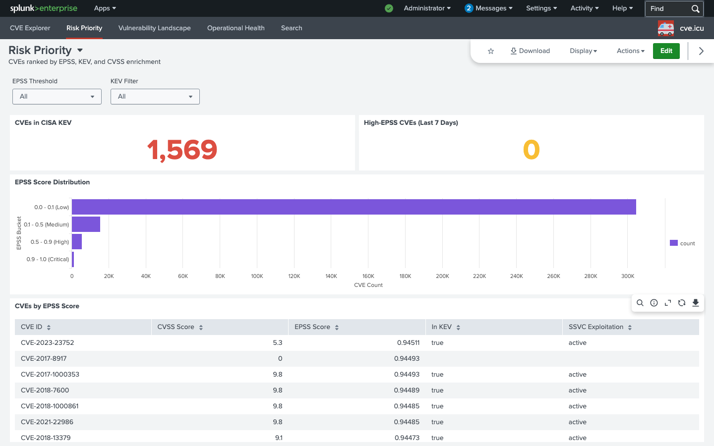
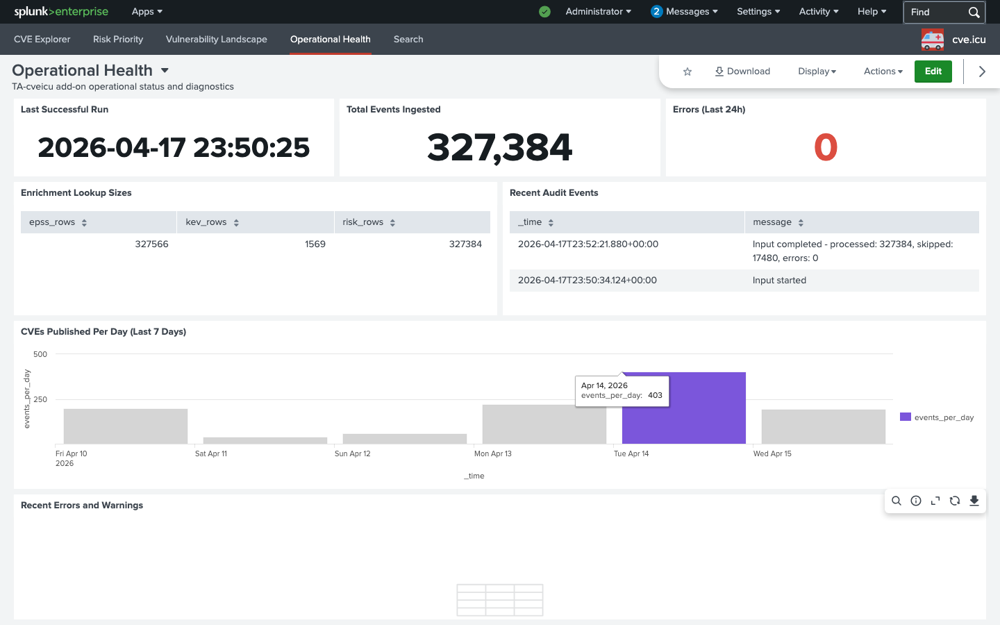

# cve.icu — CVE Intelligence for Splunk

<p align="center">
  
</p>

Splunk Technology Add-on for ingesting the complete CVE V5 database (327,000+ vulnerabilities) with EPSS, KEV, SSVC, and CVSS enrichment. Data starts flowing immediately after installation — no API keys or setup required.

## Install

**[Download from Splunkbase](https://splunkbase.splunk.com/app/8395)** or install via **Apps > Manage Apps > Install app from file** in Splunk.

## Requirements

| Version    | Splunk                       | Python                                | Dashboard Format    |
| ---------- | ---------------------------- | ------------------------------------- | ------------------- |
| **v2.0.x** | Splunk 10.0+ or Splunk Cloud | Python 3.11+ (bundled with Splunk 10) | Dashboard Studio v2 |
| **v1.1.2** | Splunk 9.3+                  | Python 3.9+ (bundled with Splunk 9)   | SimpleXML           |

> **Splunk 9 users**: Use the [v1.x branch](https://github.com/RogoLabs/CVE.icu-Splunk/tree/v1.x) — same features, same data, SimpleXML dashboards compatible with Splunk 9.3+.

## Documentation

- **[Add-on documentation](TA-cveicu/README.md)** — Configuration, fields, searches, troubleshooting
- **[Splunkbase listing](https://splunkbase.splunk.com/app/8395)** — Install, details, release notes
- **[Screenshots](docs/screenshots/)** — Dashboard previews
- **[Release notes](docs/release-notes/)** — Version history

## Dashboards

### Vulnerability Landscape

Executive overview with KPIs, severity distribution, top vendors, weekly trends, and CISA KEV growth.



### CVE Explorer

Search and filter the full CVE database by vendor, severity, CWE, or keyword. Shows publication trends and detailed CVE records.



### Risk Priority

Triage view combining EPSS scores, CISA KEV status, and CVSS data. Filter by EPSS threshold and KEV membership.



### Operational Health

Ingestion diagnostics, error monitoring, enrichment lookup sizes, and daily volume tracking.



## Troubleshooting (Splunk 9)

If modular inputs don't appear under **Settings > Data Inputs** after installing v1.1.x:

1. **Verify scheme output** — Run this on the Splunk server:

   ```bash
   /opt/splunk/bin/splunk cmd python3 /opt/splunk/etc/apps/TA-cveicu/bin/cveicu.py --scheme
   ```

   You should see XML starting with `<scheme><title>cve.icu</title>`. If you see a Python error instead, check file permissions.

2. **Check file permissions** — Ensure the scripts are executable:

   ```bash
   chmod +x /opt/splunk/etc/apps/TA-cveicu/bin/*.py
   ```

3. **Verify via REST API**:

   ```bash
   curl -k -u admin:yourpassword https://localhost:8089/servicesNS/admin/TA-cveicu/data/inputs/cveicu
   ```

4. **Restart Splunk** — Input types are discovered at startup. A restart is required after install.

5. **Manual input creation** (fallback) — If the UI doesn't show the input type, create one via REST:
   ```bash
   curl -k -u admin:yourpassword https://localhost:8089/servicesNS/admin/TA-cveicu/data/inputs/cveicu \
     -d name=default -d index=main -d include_adp=true -d include_rejected=false -d batch_size=500
   ```

## Links

- **Website**: [cve.icu](https://cve.icu)
- **Issues**: [GitHub Issues](https://github.com/RogoLabs/CVE.icu-Splunk/issues)
- **Support**: support@rogolabs.net

## License

Apache License 2.0
